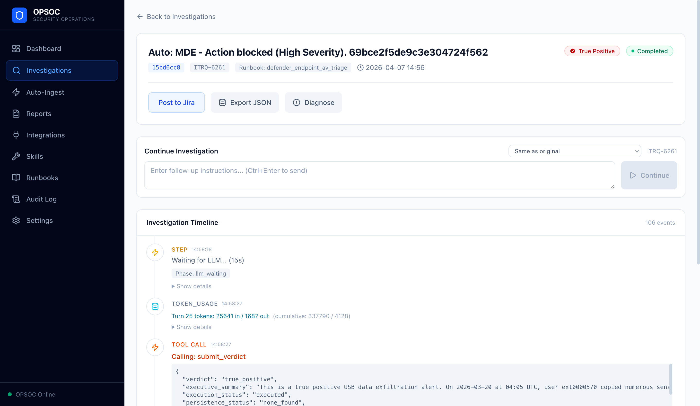
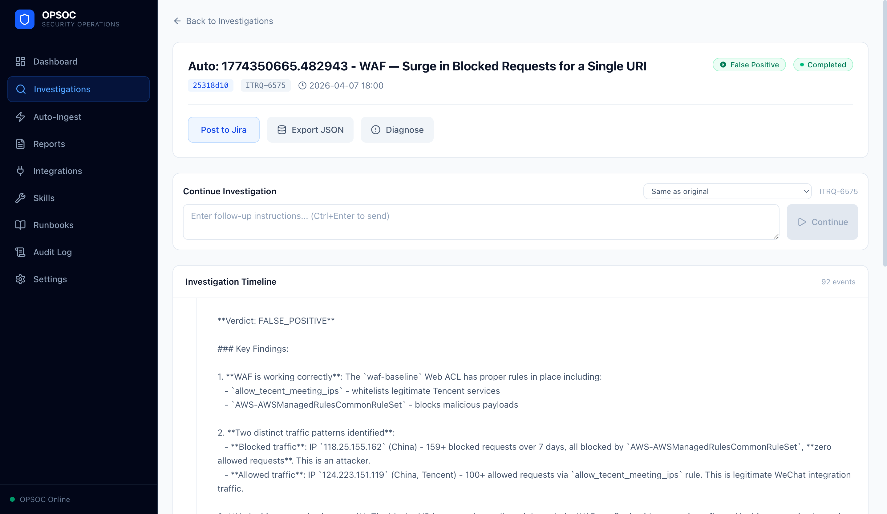

# OPSOC — One Person Security Operation Center

> AI-powered SOC platform that replaces traditional MSSP with LLM-driven automated investigation.
>
> 用 AI 替代传统 MSSP，实现一个人运营完整安全运营中心。

[English](#english) | [中文](#中文)

---

<a name="english"></a>

## The Problem

Traditional MSSPs (Managed Security Service Providers) cost hundreds of thousands per year, yet produce low-quality analysis that creates **alert fatigue** rather than reducing it. Security teams spend most of their time on false positive triage — manually cross-referencing alerts across Defender, Splunk, Jira, and other platforms.

## The Solution

**OPSOC** is a production-grade AI SOC platform built for a dual-listed biopharma company (NASDAQ/HKEX). It sits on top of the existing MSSP workflow, auto-ingests their Jira escalation cases and Defender alerts, cross-references across 5 security platforms, and produces structured investigation reports with verdicts.

One security professional + OPSOC = complete SOC operation.

## Key Metrics (Production Data)

| Metric | Value |
|--------|-------|
| Investigations completed | 75+ |
| False positive identification rate | 65%+ |
| Average investigation time | 30-60 seconds |
| Platform integrations | 5 (XDR, SIEM, ITSM, Cloud, Firewall) |
| LLM providers supported | 12 (cloud + local) |
| Security skills (tools) | 34 across 5 platforms |

## Screenshots

### Dashboard
Real-time overview with investigation statistics, LLM token usage, and platform connectivity status.


### Investigation List
Resizable columns, sortable, filterable by status/verdict/source. Copy-on-click for IDs.


### Investigation Detail — True Positive
MDE alert investigation showing real-time streaming timeline, structured verdict with dimensional analysis, and Jira integration.



### Investigation Detail — False Positive
WAF alert automatically identified as false positive with detailed reasoning. Investigation completed in seconds.



### Reports
Filterable by verdict, source, runbook, and date range. Clickable summary cards. Server-side pagination with global aggregates.


### Auto-Ingest
Automated polling from Jira MSSP cases and Defender alerts. Fallback LLM on empty investigations. Real-time cycle tracking.


### Platform Integrations
5 platforms with connectivity testing: Microsoft XDR (Defender/Entra), Splunk Cloud, Jira Cloud, AWS, FortiAnalyzer.


### Skills Registry
34 security tools across 5 platforms — atomic queries, pre-packaged investigation steps, and write operations (gated).


### Settings — LLM Providers
Multi-provider LLM system supporting 12 provider types including local models (Ollama, vLLM, LM Studio). Credential isolation — only ENV var names stored, never actual keys.


### Audit Log
Complete investigation audit trail with date range filtering and CSV export. 5,600+ events tracked.


### Runbooks
Obligation-based investigation quality gates. Automated compliance checking with 86% completion rate.


## Architecture

```
┌─────────────────────────────────────────────────────────┐
│                    OPSOC Web UI (React)                  │
│  Dashboard │ Investigations │ Reports │ Auto-Ingest │ ...│
├─────────────────────────────────────────────────────────┤
│                  FastAPI Backend + SQLite                 │
│  Investigation Engine │ Audit │ LLM Providers │ Skills   │
├─────────────────────────────────────────────────────────┤
│              LangGraph Agent Loop (per investigation)    │
│  ┌──────────┐  ┌──────────┐  ┌──────────────────────┐   │
│  │ Routing  │→ │ Skill    │→ │ Verdict + Enforcer   │   │
│  │ + Packs  │  │ Execution│  │ (fail-closed)        │   │
│  └──────────┘  └──────────┘  └──────────────────────┘   │
├─────────────────────────────────────────────────────────┤
│                  Multi-Provider LLM Layer                │
│  OpenRouter │ Kimi │ Anthropic │ OpenAI │ Ollama │ ...   │
├─────────────────────────────────────────────────────────┤
│                   34 Security Skills                     │
│  ┌───────────┐ ┌────────┐ ┌──────┐ ┌─────┐ ┌────────┐  │
│  │ Microsoft │ │ Splunk │ │ Jira │ │ AWS │ │ Forti  │  │
│  │ XDR/Entra │ │ Cloud  │ │Cloud │ │     │ │Analyzer│  │
│  └───────────┘ └────────┘ └──────┘ └─────┘ └────────┘  │
└─────────────────────────────────────────────────────────┘
```

## Core Design Principles

- **Fail-closed**: Every investigation path that can't reach a verdict escalates — never silently drops alerts
- **MSSP as untrusted input**: MSSP reports are raw data to verify, not ground truth
- **Audit trail is non-negotiable**: Every decision and action is logged (5,600+ events)
- **LLM-agnostic**: Supports 12 provider types, switchable per investigation, including local models
- **Security-first**: Read-only by default, credential isolation, content redaction pipeline

## Tech Stack

| Layer | Technology |
|-------|-----------|
| Agent Framework | LangGraph (Python) |
| Backend | FastAPI + SQLite (WAL mode) |
| Frontend | React + TypeScript + Tailwind CSS |
| LLM | Multi-provider (OpenRouter, Kimi, Anthropic, OpenAI, ChatGPT Codex, Ollama, vLLM, ...) |
| Platforms | Microsoft Defender XDR, Splunk Cloud, Jira Cloud, AWS, FortiAnalyzer |
| Development | Claude Code (Opus 4.6) + Codex (GPT-5.4) review |

## Development Methodology

This project uses a **dual-AI development workflow**:
- **Claude Code (Opus 4.6)**: Primary developer — architecture, implementation, self-review with mandatory invariant verification
- **Codex (GPT-5.4)**: Independent reviewer — finds architectural blind spots that the implementer can't see from inside the code
- **Three Engineering Disciplines**: Side-Effect Awareness, Failure Atomicity, Integration Boundary verification — enforced on every code change
- **5-step change workflow**: Proposal → Implementation → Invariant Verification → Runtime Evidence → Codex Review

## About the Author

**Rex Zhou** — CISSP, CCIE, 14 years in information security. Security Operations Manager building the next generation of AI-powered security operations.

- This project demonstrates that a single security professional, armed with the right AI tools, can operate a complete SOC for a publicly-traded company.
- Source code is private. This repository contains documentation and demo materials only.

---

<a name="中文"></a>

## 项目简介

**OPSOC (One Person Security Operation Center)** 是一个生产级 AI 安全运营平台，部署于一家纳斯达克/港交所双重上市的生物制药公司。

### 解决的问题

传统 MSSP（托管安全服务提供商）每年花费数十万，但产出的分析质量低下，制造**告警疲劳**而非减少它。安全团队大部分时间花在误报分流上 — 手动在 Defender、Splunk、Jira 等平台之间交叉验证。

### 解决方案

OPSOC 接入现有 MSSP 工作流，自动摄入 Jira 升级案例和 Defender 告警，跨 5 个安全平台交叉关联，产出带结构化判定（True Positive / False Positive / Inconclusive）的调查报告。

**一个安全专家 + OPSOC = 完整的 SOC 运营。**

### 核心指标（生产数据）

- 已完成调查：75+
- 误报识别率：65%+
- 平均调查时间：30-60 秒
- 平台集成：5 个（XDR、SIEM、ITSM、Cloud、Firewall）
- 支持 LLM 提供商：12 个（含本地模型）
- 安全技能（工具）：34 个，覆盖 5 个平台

### 技术亮点

- **LangGraph Agent Loop**: 每次调查运行独立的 agent loop，基于告警类型自动选择 skill pack
- **Fail-closed 设计**: 所有无法得出结论的调查路径都会升级，绝不静默丢弃告警
- **多模型支持**: 12 种 LLM provider，每次调查可独立选择模型，支持 Ollama/vLLM 本地部署
- **Runbook Enforcer**: 四状态义务模型（met/not_applicable/unavailable/missing），自动质量门控
- **完整审计链**: 每个决策和操作都有记录，5,600+ 事件

### 开发方法

采用 **双 AI 开发工作流**：
- **Claude Code (Opus 4.6)**: 主开发者 — 架构设计、代码实现、带不变量验证的自审
- **Codex (GPT-5.4)**: 独立审查者 — 发现实现者从代码内部看不到的架构盲点
- **三条工程纪律**: 副作用感知、失败原子性、集成边界验证 — 每次代码变更强制执行

### 关于作者

**Rex Zhou** — CISSP, CCIE, 14 年信息安全经验。安全运营经理，致力于构建下一代 AI 驱动的安全运营。

- 本项目证明：一个安全专家配合正确的 AI 工具，可以为一家上市公司运营完整的 SOC
- 源代码为私有仓库，本仓库仅包含文档和演示材料

---

*Built with Claude Code (Opus 4.6) + Codex (GPT-5.4) review pipeline*
