# OPSOC — One Person Security Operation Center

> AI-powered SOC that turns one security professional into a complete security operations team.
>
> 用 AI 让一个安全专家胜任完整的安全运营团队。

[English](#english) | [中文](#中文)

---

<a name="english"></a>

## Impact

| Before (MSSP) | After (OPSOC) |
|----------------|---------------|
| ~1M RMB/year MSSP contract | ~100K RMB/year (LLM API costs) |
| Hours per investigation (manual cross-platform triage) | 30-60 seconds per investigation (automated) |
| 65%+ alerts are false positives, each still requires human review | False positives auto-dismissed with evidence trail |
| MSSP analysts lack company context, produce generic reports | Investigations leverage full enterprise context — asset ownership, business criticality, historical patterns |

## The Problem

Enterprise security teams face a structural dilemma: MSSPs are expensive and produce shallow analysis because outsourced analysts have no context about your organization. They don't know which servers are critical, which users are executives, or which "suspicious" activity is actually a routine business process. The result is alert fatigue — hundreds of cases per month, most of which are false positives that still require manual review.

Hiring an in-house SOC team solves the context problem but costs 3-5x more and is impractical for mid-sized companies.

## The Insight: Why "One Person" Matters

The key insight behind OPSOC is that **the most valuable part of security operations is tacit knowledge** — the institutional understanding that lives in one experienced security professional's head:

- Which systems are business-critical and which are development sandboxes
- The company's technology stack, network topology, and normal traffic patterns
- Historical incident patterns and known false-positive signatures
- Regulatory context (GxP, FDA/NMPA compliance requirements for biopharma)
- Relationships with IT, business owners, and external vendors

This knowledge cannot be transferred to an MSSP. But it can be encoded into an AI system's investigation context. **OPSOC makes one person's expertise scalable** — the human provides judgment and context, the AI provides speed and breadth.

## The Solution

**OPSOC** is a production-grade AI SOC platform deployed at a dual-listed biopharma company (NASDAQ/HKEX). It sits on top of the existing MSSP workflow:

1. **Auto-ingests** MSSP Jira escalation cases and Defender alerts
2. **Cross-references** across 5 security platforms (XDR, SIEM, ITSM, Cloud, Firewall)
3. **Produces** structured investigation reports with verdicts (True Positive / False Positive / Inconclusive)
4. **Enforces** investigation quality through obligation-based runbooks
5. **Maintains** complete audit trail for compliance

The operator reviews OPSOC's verdicts, handles true positives that require human action, and continuously improves the system's investigation logic.

## Key Metrics (Production Data, 2026-04-27)

| Metric | Value |
|--------|-------|
| Investigations completed | 99+ |
| False positive identification rate | 65%+ |
| Average investigation time | 30-60 seconds |
| Cost reduction | ~90% vs. MSSP contract |
| Platform integrations | 5 (XDR, SIEM, ITSM, Cloud, Firewall) + Microsoft Graph (Teams) |
| LLM providers supported | 12 (cloud + local) |
| Runbooks (obligation gates) | 5 active families |
| KQL hunting queries | 11 (auto-run every 15 min) |

## Vision & Roadmap

OPSOC currently covers **Blue Team Incident Response** — the MSSP replacement layer. The long-term vision is to apply the same AI-augmented approach across all security operations domains:

```
Phase 1 (Current) — Incident Response
  ✅ MSSP case triage and investigation
  ✅ Automated cross-platform evidence collection
  ✅ Structured verdicts with quality enforcement

Phase 2 (Planned) — Detection Engineering
  ○ Auto-tune detection rules based on false positive patterns
  ○ Generate Splunk/KQL correlation rules from investigation findings
  ○ Feedback loop: investigation results improve detection accuracy

Phase 3 (Planned) — Vulnerability Management
  ○ Prioritize vulnerabilities using business context (asset criticality, exposure)
  ○ Cross-reference CVE data with actual environment configuration
  ○ Track remediation across teams with automated follow-up

Phase 4 (Planned) — Red Team / Offensive Security
  ○ AI-assisted attack surface analysis
  ○ Automated reconnaissance using the same skill framework
  ○ Purple team exercises: compare detection coverage vs. attack paths
```

The unifying principle: **AI amplifies the security professional's institutional knowledge across every domain**, not just incident response. The skill-based architecture (34 tools today) is designed to expand into each new domain without rebuilding the core.

## What's New Since Initial Demo (Apr 8 → Apr 27, 2026)

The Apr 8 demo video shows the core investigation loop. Three weeks of follow-on work brought
substantial new capabilities:

| Capability | Date |
|---|---|
| **Phase 1 — Entity extraction + Structured Report** (deterministic IOC grounding, Pydantic-validated canonical report) | Apr 9 |
| **Phase 2 — Security Event Model** (auto-correlate investigations by entity overlap, derived status, combined timeline) | Apr 9 |
| **Phase 3 — Case Memory** (human-confirmed only, 3-signal matching, prompt injection as reference-only context) | Apr 11 |
| **Hunting Module** (11 KQL queries from real APT, auto-run every 15min via MDE Advanced Hunting) | Apr 16 |
| **Teams TP Notification** (delegated OAuth as soc@, Adaptive Card with IOC table + next actions, recipient management UI) | Apr 27 |
| **Verdict Ratchet** (safety-rank ordering across 3 verdict-write paths to prevent weak-model downgrade) | Apr 27 |

## Live Investigation Demo

A Defender alert investigation — from natural language query to structured verdict — running against live production security platforms.

[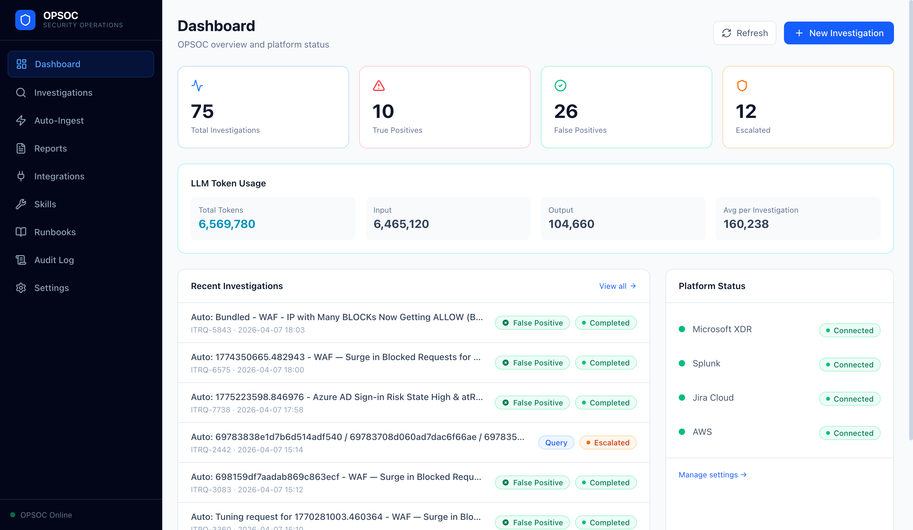](https://youtu.be/VuMIycNDEQY)

> **Click to watch.** The analyst types a free-form query about a Defender alert (FileZilla unwanted software detection). OPSOC's AI agent automatically calls `defender_raw_hunt` to search alerts, `get_asset_context` for device info, `get_device_timeline` for activity history, and `jira_search_issues` to cross-reference MSSP records — then delivers a structured False Positive verdict with full evidence trail. 10 turns, ~120 seconds, less than $0.02 in LLM API costs.

---

## Screenshots

### Dashboard
Real-time overview with investigation statistics, LLM token usage, and platform connectivity status. Clickable stat cards link directly to filtered investigation views.


### Investigation List
Resizable columns, sortable by any column, filterable by status/verdict/source. Copy-on-click for IDs. Column visibility toggle.

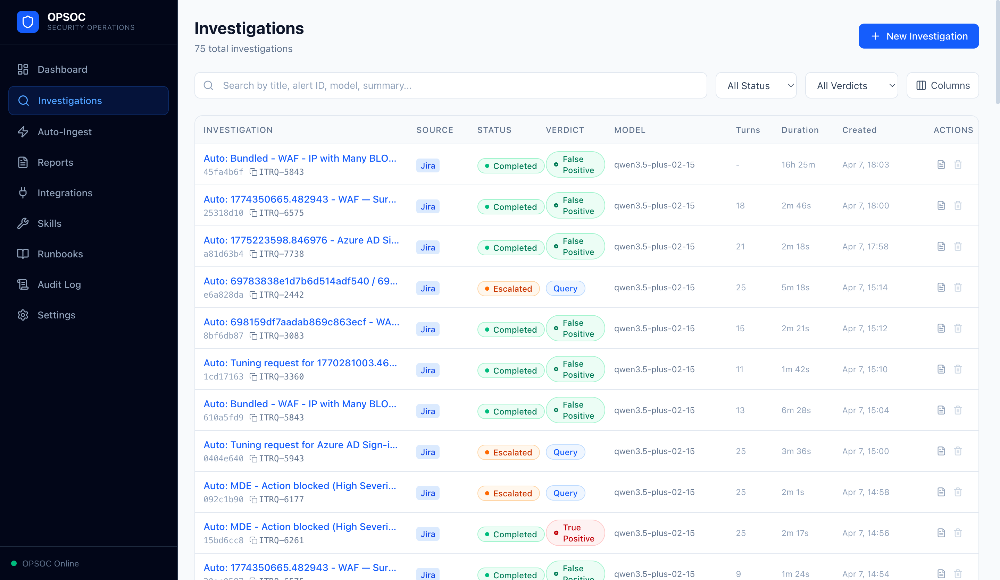

### Reports
Filterable by verdict, source, runbook, and date range. Clickable summary cards. Server-side pagination with global aggregates.

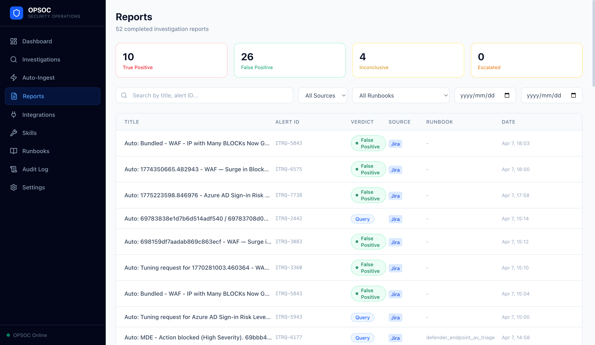

### Auto-Ingest
Automated polling from Jira MSSP cases and Defender alerts. Primary + fallback LLM configuration. Real-time cycle tracking with investigation results.

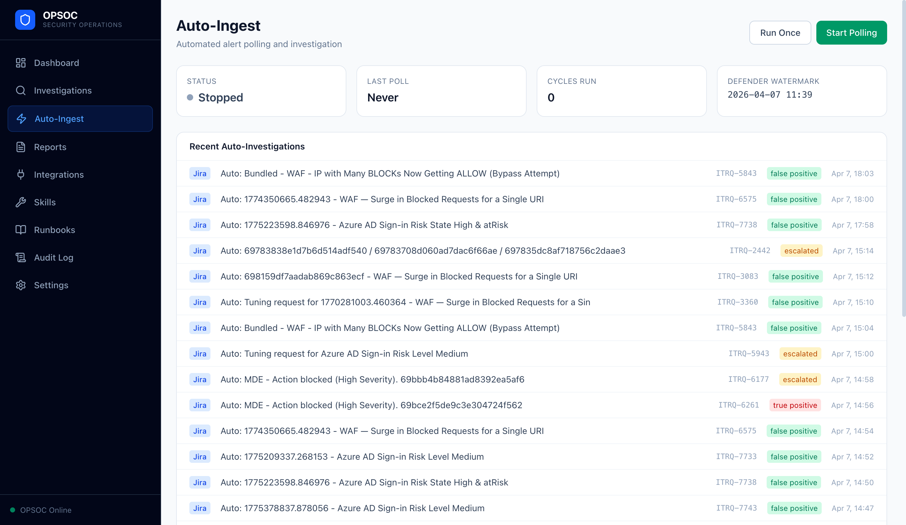

### Platform Integrations
5 platforms with one-click connectivity testing. All credentials masked — only ENV variable names stored in database.

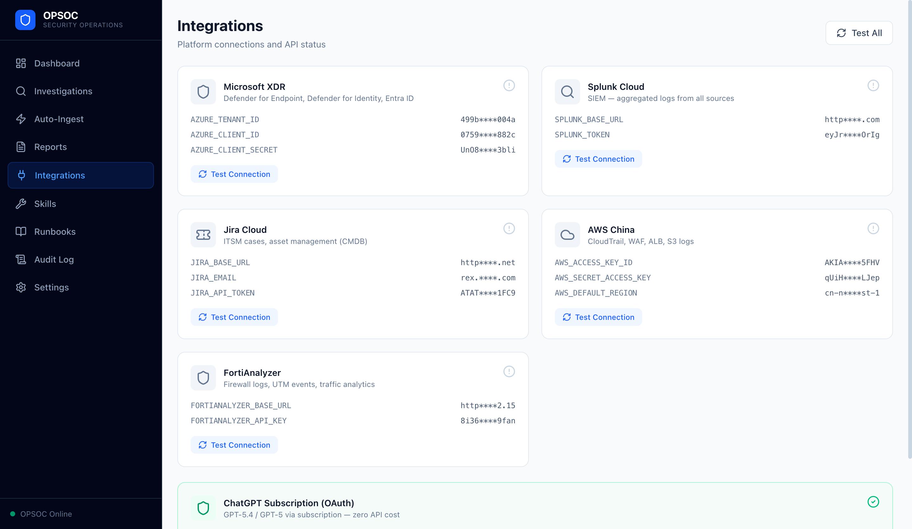

### Skills Registry
34 security tools across 5 platforms — atomic queries, pre-packaged investigation steps, and write operations (gated). Searchable by name and filterable by platform.

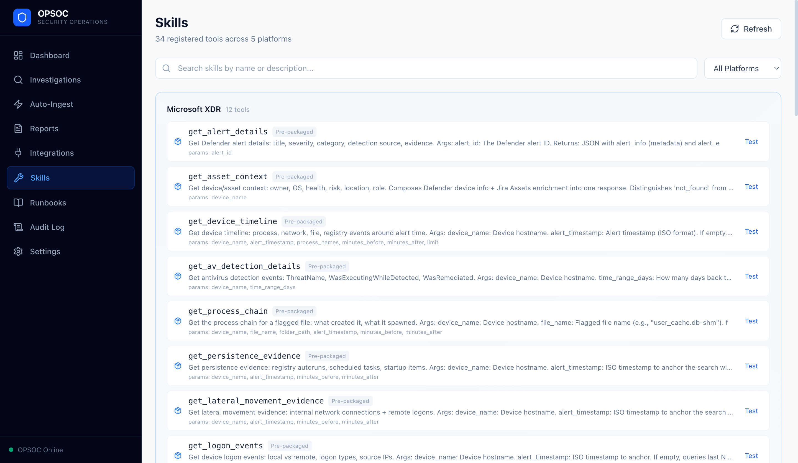

### Settings — LLM Providers
Multi-provider LLM system supporting 12 provider types including local models (Ollama, vLLM, LM Studio). Each provider independently configurable with contextual setup guidance.

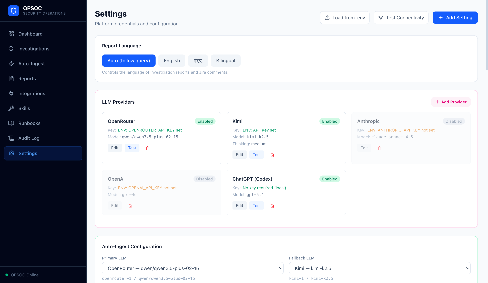

### Audit Log
Complete investigation audit trail with date range filtering and CSV export (up to 10,000 events). Every tool call, verdict decision, and status change recorded.

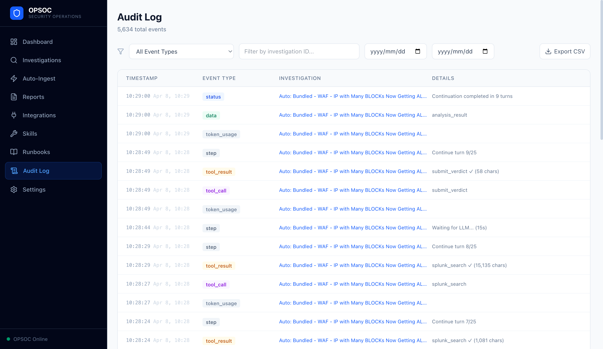

### Runbooks
Obligation-based investigation quality gates. Each runbook defines required evidence (skills that must be called) and required report fields. 5 active runbook families (defender_endpoint_av_triage, splunk_mssp_triage, defender_alert_triage, defender_coverage, context_zailab).

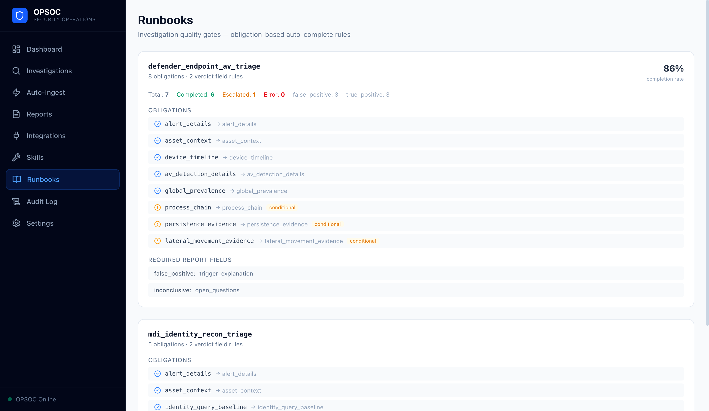

### Hunting (Apr 16, 2026)
Proactive KQL threat hunting integrated into the auto-ingest cycle. 11 queries derived from a real APT incident — webshell creation, tunnel tools, SQL CLR injection, suspicious parent/child, staging directory activity, credential access tools, w3wp suspicious path, binary masquerading, known C2 IP/domain CLI, net user password change. Findings are deduped by `(query_name + event timestamp + dedup fields)` and the watermark advances fail-closed — only when all queries succeed in a cycle.

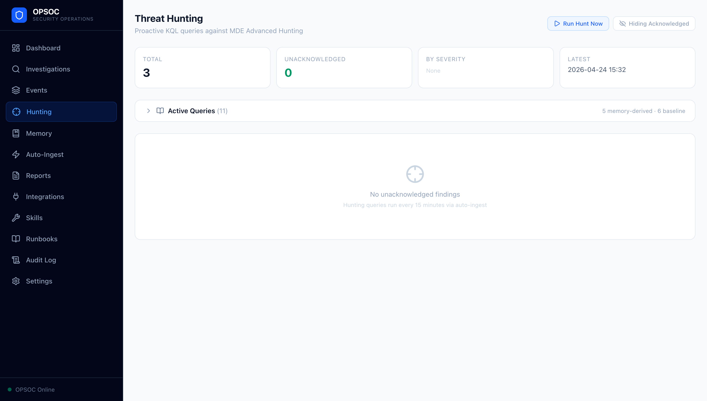

### Memory (Apr 11, 2026)
Human-confirmed case memory with revision tracking. Each memory entry references a specific revision of the source investigation; mutating the verdict marks the memory stale. Three-signal matching (entity overlap × 2 + alert_type × 1 + title text overlap × 1.5) means first-round investigations can pull historical context even before tool calls have populated entities.

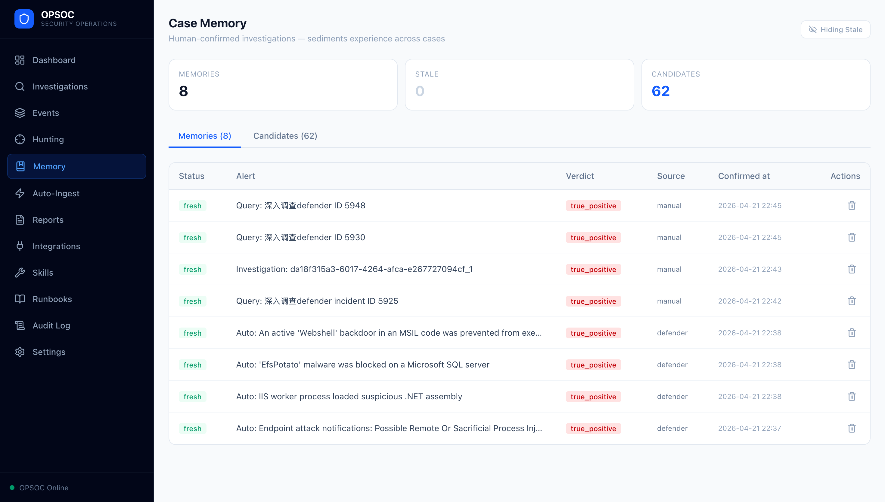

### Events (Apr 9, 2026)
Investigations auto-correlate into Security Events when their extracted entities overlap within a 4-hour symmetric window. Derived status (`confirmed_threat > needs_review > investigating > false_alarm > open`) is computed from constituent investigation verdicts; the combined timeline merges all member investigations chronologically. Manual unlink supported.

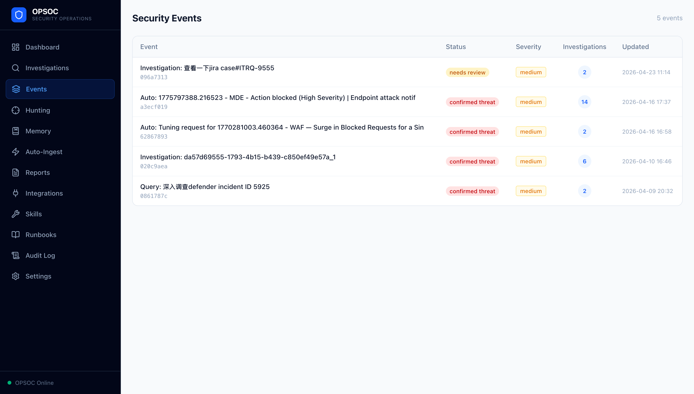

### Teams Notifications — Settings (Apr 27, 2026)
TP investigations dispatch a Teams Adaptive Card to operator-managed recipients. Authentication secrets stay in `.env`; only the recipient list is editable from the UI. DM (per-UPN), group chat (chat_id), and channel (team_id + channel_id) targets all supported. Auto-seeded from legacy env vars on first boot for backward compatibility.

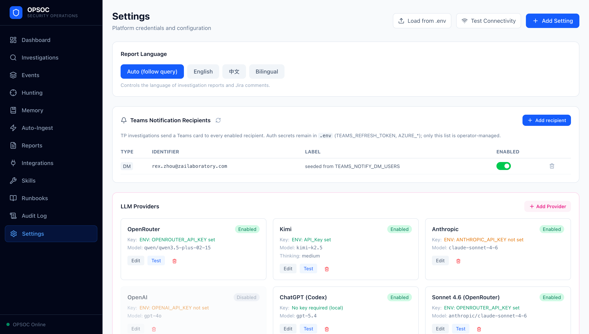

### Teams Notifications — Investigation Detail
Per-investigation notification panel renders only on `verdict='true_positive'`. Read-only `GET` endpoint on panel mount (no Graph send), explicit `Resend` button for operator-driven retry. Each row shows target type, identifier, status badge (sent / failed / pending / indeterminate / skipped), claimed/completed timestamps, message_id for sent rows, expandable error JSON, and a clear button for failed/indeterminate rows.

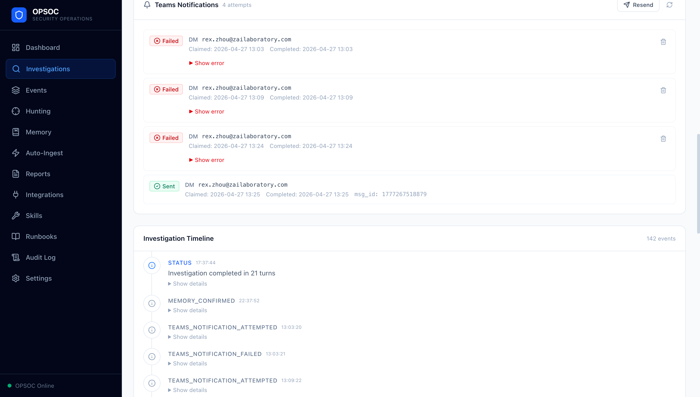

## Architecture

```
┌──────────────────────────────────────────────────────────────────────┐
│                         OPSOC Web UI (React, 15 pages)                │
│  Dashboard │ Investigations │ Reports │ Auto-Ingest │ Hunting │      │
│  Memory │ Events │ Settings (recipients + LLM) │ ...                  │
├──────────────────────────────────────────────────────────────────────┤
│                       FastAPI Backend + SQLite                        │
│  Investigation │ Audit │ LLM Providers │ Skills │ Notifications      │
│  Memory │ Events │ Hunting │ Replay Eval                              │
├──────────────────────────────────────────────────────────────────────┤
│              LangGraph Agent Loop (per investigation)                 │
│  ┌──────────┐  ┌──────────┐  ┌──────────────────────────┐            │
│  │ Routing  │→ │ Skill    │→ │ Verdict + Enforcer       │            │
│  │ + Packs  │  │ Execution│  │ (safety-rank ratchet,    │            │
│  └──────────┘  └──────────┘  │  alert-context aware)    │            │
│       │            │         └──────────────────────────┘            │
│       │            ↓                                                  │
│       │     ┌──────────────────┐    ┌────────────────────┐           │
│       │     │ Entity Extraction│ →  │ Case Memory        │           │
│       │     │ (deterministic)  │    │ (3-signal match)   │           │
│       │     └──────────────────┘    └────────────────────┘           │
│       │                                       │                       │
│       ↓                                       ↓                       │
│  ┌────────────────────┐         ┌────────────────────────┐            │
│  │ Security Events    │ ←───── │ Investigation Report   │            │
│  │ (entity overlap)   │         │ (Pydantic-validated)  │            │
│  └────────────────────┘         └────────────────────────┘            │
├──────────────────────────────────────────────────────────────────────┤
│            Auto-Ingest (15min cycle) + Proactive Hunting              │
│  Jira poll │ Defender poll │ 11 KQL queries (MDE Advanced Hunting)   │
├──────────────────────────────────────────────────────────────────────┤
│                       Multi-Provider LLM Layer                        │
│  OpenRouter │ Kimi │ Anthropic │ OpenAI │ ChatGPT Codex │ Ollama │   │
├──────────────────────────────────────────────────────────────────────┤
│                          25 Security Skills                           │
│  ┌───────────┐ ┌────────┐ ┌──────┐ ┌─────┐ ┌────────┐ ┌───────────┐ │
│  │ Microsoft │ │ Splunk │ │ Jira │ │ AWS │ │ Forti  │ │ Microsoft │ │
│  │ XDR/Entra │ │ Cloud  │ │Cloud │ │     │ │Analyzer│ │ Graph     │ │
│  │ + MDE LR  │ │        │ │ +CMDB│ │     │ │ (RPC)  │ │ (Teams)   │ │
│  └───────────┘ └────────┘ └──────┘ └─────┘ └────────┘ └───────────┘ │
└──────────────────────────────────────────────────────────────────────┘
```

## Core Design Principles

- **Fail-closed**: Every investigation path that can't reach a verdict escalates — never silently drops alerts
- **MSSP as untrusted input**: MSSP reports are raw data to verify, not ground truth
- **Audit trail is non-negotiable**: Every decision and action is logged
- **LLM-agnostic**: 12 provider types, switchable per investigation, including local models for sensitive environments
- **Security-first**: Read-only API access by default, credential isolation, content redaction pipeline

## Tech Stack

| Layer | Technology |
|-------|-----------|
| Agent Framework | LangGraph (Python) |
| Backend | FastAPI + SQLite (WAL mode), 16 tables |
| Frontend | React + TypeScript + Tailwind CSS, 15 pages |
| LLM | Multi-provider (OpenRouter, Kimi, Anthropic, OpenAI, ChatGPT Codex, Ollama, vLLM, ...) |
| Platforms | Microsoft Defender XDR, Splunk Cloud, Jira Cloud, AWS, FortiAnalyzer, Microsoft Graph (Teams) |
| Development | Claude Code (Opus 4.7) + Codex (GPT-5.4) review |

## Development Methodology

This project uses a **dual-AI development workflow**:
- **Claude Code (Opus 4.6)**: Primary developer — architecture, implementation, self-review with mandatory invariant verification
- **Codex (GPT-5.4)**: Independent reviewer — finds architectural blind spots that the implementer can't see from inside the code
- **Three Engineering Disciplines**: Side-Effect Awareness, Failure Atomicity, Integration Boundary verification — enforced on every code change
- **5-step change workflow**: Proposal → Implementation → Invariant Verification → Runtime Evidence → Codex Review

## About the Author

**Rex Zhou** — CISSP, CCIE, 14 years in information security. Security Operations Manager building the next generation of AI-powered security operations.

- This project demonstrates that one security professional, armed with the right AI tools, can deliver SOC operations that exceed what a traditional MSSP team provides — with better accuracy, faster response, and at a fraction of the cost.
- Source code is private. This repository contains documentation and demo materials only.

---

<a name="中文"></a>

## 影响

| 改变前（MSSP） | 改变后（OPSOC） |
|----------------|----------------|
| 每年约 100 万元 MSSP 合同 | 每年约 10 万元（LLM API 成本） |
| 每个调查数小时（手动跨平台分流） | 每个调查 30-60 秒（自动化） |
| 65%+ 告警是误报，每个仍需人工审查 | 误报自动识别并附完整证据链 |
| MSSP 分析师缺乏企业背景，产出通用报告 | 调查利用完整的企业上下文 — 资产归属、业务关键性、历史模式 |

## 问题

企业安全团队面临结构性困境：MSSP 价格昂贵但分析质量浅薄，因为外包分析师对你的组织没有任何上下文。他们不知道哪些服务器是关键的，哪些用户是高管，哪些"可疑"活动实际上是日常业务流程。结果就是告警疲劳 — 每月数百个案例，绝大部分是误报，但每一个仍需人工审查。

组建内部 SOC 团队解决了上下文问题，但成本高出 3-5 倍，对中型企业来说不现实。

## 核心洞察：为什么"一个人"很重要

OPSOC 背后的核心洞察是：**安全运营中最有价值的部分是隐性知识** — 那些存在于一个资深安全专家头脑中的组织理解：

- 哪些系统是业务关键的，哪些是开发沙箱
- 公司的技术栈、网络拓扑和正常流量模式
- 历史事件模式和已知的误报特征
- 监管合规背景（GxP、FDA/NMPA 对生物制药的要求）
- 与 IT、业务负责人和外部供应商的关系

这些知识无法转移给 MSSP。但它可以编码到 AI 系统的调查上下文中。**OPSOC 让一个人的专业能力可扩展** — 人提供判断力和上下文，AI 提供速度和广度。

## 解决方案

**OPSOC** 是一个生产级 AI SOC 平台，部署于一家纳斯达克/港交所双重上市的生物制药公司：

1. **自动摄入** MSSP 的 Jira 升级案例和 Defender 告警
2. **跨平台关联** 5 个安全平台（XDR、SIEM、ITSM、Cloud、Firewall）
3. **产出** 带结构化判定的调查报告（True Positive / False Positive / Inconclusive）
4. **质量保障** 通过基于义务的 Runbook 强制执行调查质量
5. **完整审计** 每个决策和操作都有记录

运营人员审查 OPSOC 的判定，处理需要人工干预的真阳性事件，并持续改进系统的调查逻辑。

## 核心指标（生产数据，2026-04-27）

| 指标 | 数值 |
|------|------|
| 已完成调查 | 99+ |
| 误报识别率 | 65%+ |
| 平均调查时间 | 30-60 秒 |
| 成本降低 | 相比 MSSP 合同降低约 90% |
| 平台集成 | 5 个（XDR、SIEM、ITSM、Cloud、Firewall）+ Microsoft Graph（Teams 通知） |
| 支持 LLM 提供商 | 12 个（含本地模型） |
| Runbook（义务质量门）| 5 个活跃家族 |
| KQL Hunting 查询 | 11 个（每 15 分钟自动运行） |

## 实时调查演示

一个 Defender 告警调查 — 从自然语言查询到结构化判定 — 对接生产安全平台实时运行。

[](https://youtu.be/VuMIycNDEQY)

> **点击观看。** 分析师输入自由查询（FileZilla 捆绑软件检测），OPSOC AI Agent 自动调用 `defender_raw_hunt` 搜索告警、`get_asset_context` 获取设备信息、`get_device_timeline` 查询活动历史、`jira_search_issues` 交叉比对 MSSP 记录 — 最终输出结构化 False Positive 判定及完整证据链。10 轮对话，约 120 秒，LLM API 成本不到 $0.02。

---

## 愿景与路线图

OPSOC 当前覆盖 **Blue Team 事件响应** — 即 MSSP 替代层。长期愿景是将同样的 AI 增强方法应用到安全运营的所有领域：

```
第一阶段（当前） — 事件响应
  ✅ MSSP 案例分流与调查
  ✅ 自动化跨平台证据收集
  ✅ 结构化判定 + 质量门控

第二阶段（规划中） — 检测工程
  ○ 基于误报模式自动调优检测规则
  ○ 从调查结果生成 Splunk/KQL 关联规则
  ○ 反馈闭环：调查结果改善检测准确度

第三阶段（规划中） — 漏洞管理
  ○ 利用业务上下文确定漏洞优先级（资产关键性、暴露面）
  ○ 将 CVE 数据与实际环境配置交叉比对
  ○ 跨团队追踪修复进度

第四阶段（规划中） — Red Team / 攻击性安全
  ○ AI 辅助攻击面分析
  ○ 使用同一技能框架进行自动化侦察
  ○ Purple Team 演练：检测覆盖 vs. 攻击路径对比
```

统一原则：**AI 将安全专家的组织知识放大到每个领域**，而不仅仅是事件响应。技能架构（目前 34 个工具）设计为可扩展到每个新领域，无需重建核心。

## 技术亮点

- **LangGraph Agent Loop**: 每次调查运行独立的 agent loop，基于告警类型自动选择 skill pack
- **Fail-closed 设计**: 所有无法得出结论的调查路径都会升级，绝不静默丢弃告警
- **多模型支持**: 12 种 LLM provider，每次调查可独立选择模型，支持 Ollama/vLLM 本地部署
- **Runbook Enforcer**: 四状态义务模型（met/not_applicable/unavailable/missing），自动质量门控
- **完整审计链**: 每个决策和操作都有记录，5,600+ 事件

## 开发方法

采用 **双 AI 开发工作流**：
- **Claude Code (Opus 4.6)**: 主开发者 — 架构设计、代码实现、带不变量验证的自审
- **Codex (GPT-5.4)**: 独立审查者 — 发现实现者从代码内部看不到的架构盲点
- **三条工程纪律**: 副作用感知、失败原子性、集成边界验证 — 每次代码变更强制执行

## 关于作者

**Rex Zhou** — CISSP, CCIE, 14 年信息安全经验。安全运营经理，致力于构建下一代 AI 驱动的安全运营。

- 本项目证明：一个安全专家配合正确的 AI 工具，能够交付超越传统 MSSP 团队的 SOC 运营 — 更高的准确率、更快的响应速度、不到十分之一的成本
- 源代码为私有仓库，本仓库仅包含文档和演示材料

---

*Built with Claude Code (Opus 4.6) + Codex (GPT-5.4) review pipeline*
